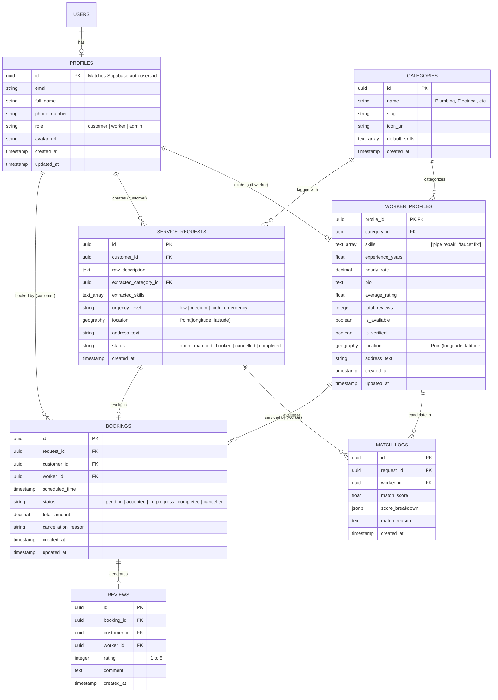
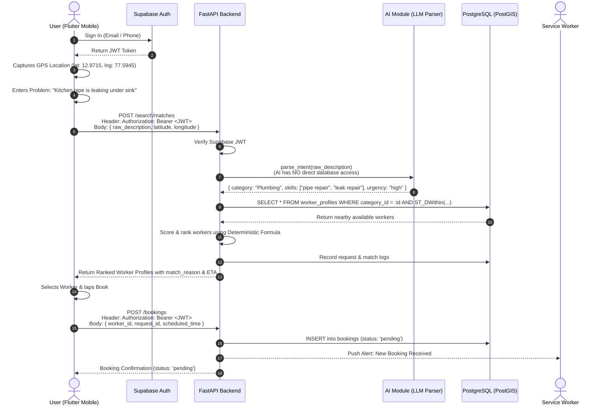

# Project Unknown - System Architecture (Approved)

## 1. System Overview & Pattern

**Project Unknown** is built as a **Modular Monolith** backend interfacing with a **Flutter cross-platform mobile application**, a managed **Supabase (PostgreSQL + PostGIS + Auth + Storage)** backend-as-a-service, and a decoupled **AI Intent & Skill Parser**.

```mermaid
graph TB
    subgraph "Client Layer (mobile/)"
        FlutterApp["Flutter Mobile App (iOS / Android)"]
    end

    subgraph "Authentication Provider"
        SupaAuth["Supabase Auth (Issues JWTs)"]
    end

    subgraph "Backend Tier - Modular Monolith (backend/)"
        FastAPI["FastAPI Modular Monolith"]
        AuthMiddleware["Supabase JWT Verification Middleware"]
        Routers["Domain Routers (/auth, /workers, /requests, /bookings, /skills)"]
        MatchOrchestrator["Matching Orchestration Service"]
        DeterministicRanker["Deterministic Ranking Engine"]
    end

    subgraph "AI Intelligence Layer (ai/)"
        AIModule["AI Intent & Skill Parser (Gemini / OpenAI Adapter)"]
    end

    subgraph "Data & Persistence Tier (database/)"
        PostgresDB[("PostgreSQL + PostGIS (Spatial & Relational Store)")]
        SupaStorage["Supabase Storage (Worker Avatars & Portfolio)"]
    end

    subgraph "External Services (Client-Side)"
        MapsService["Google Maps / Mapbox (Map Tiles & Geocoding)"]
    end

    %% Auth Flow
    FlutterApp -->|"1. Sign In / Up"| SupaAuth
    SupaAuth -->>|"Session JWT"| FlutterApp

    %% Request Flow
    FlutterApp -->|"2. Header: 'Authorization: Bearer <JWT>' + Body: lat, lng, text"| FastAPI
    FlutterApp -->|"3. Display Map & Pins"| MapsService
    FlutterApp -->|"4. Upload Photos"| SupaStorage

    %% Monolith Auth & Routing
    FastAPI --> AuthMiddleware
    AuthMiddleware -->|"Validate JWT signature"| Routers
    Routers --> MatchOrchestrator

    %% Decoupled AI & Data Flow (NO AI -> DB ACCESS)
    MatchOrchestrator -->|"A. Send Raw Problem Text"| AIModule
    AIModule -->>|"Return Category & Extracted Skills (No DB Access)"| MatchOrchestrator
    MatchOrchestrator -->|"B. Query Spatial Candidates (ST_DWithin & Category)"| PostgresDB
    PostgresDB -->>|"Return Nearby Available Workers"| MatchOrchestrator
    MatchOrchestrator -->|"C. Calculate Composite Scores"| DeterministicRanker
    DeterministicRanker -->>|"Ranked Workers + Match Reasons"| MatchOrchestrator
    MatchOrchestrator -->>|"Return Final Response"| FlutterApp
```

---

## 2. Core Architectural Decisions

### 2.1 Authentication vs. Location Separation
- **Authentication**: Handled via standard HTTP header: `Authorization: Bearer <supabase_jwt_token>`.
- **Location**: Latitude and longitude are standard payload fields passed in JSON request bodies (e.g. `{"latitude": 12.9715, "longitude": 77.5945}`) or query parameters.

### 2.2 Supabase Auth as Identity Provider
- Supabase Auth manages user credentials, OTP/password authentication, and token issuance.
- FastAPI verifies the incoming Supabase JWT signature on all protected endpoints using `SUPABASE_JWT_SECRET` (or public keys) to extract `user_id` and role claims.

### 2.3 Strict AI Decoupling (No Direct DB Access)
- The `ai/` module is a pure stateless analytical function ($Text \rightarrow JSON$).
- The AI module has **no database credentials and no database access**.
- The `Matching Orchestrator` inside `backend/` coordinates the pipeline: calling the AI module to parse the problem, then querying PostgreSQL/PostGIS independently for matching workers.

### 2.4 Deterministic Ranking for MVP v1
- Candidate scoring is computed via a transparent, deterministic mathematical formula:
  $$\text{Score} = 100 \times \left(0.40 \cdot \text{SkillMatch} + 0.30 \cdot \text{ProximityDecay} + 0.20 \cdot \text{Rating} + 0.10 \cdot \text{Experience}\right)$$
- Custom ML and embedding rankers are reserved for future phases.

### 2.5 PostGIS for Spatial Distance Filtering
- PostGIS handles spatial queries (`ST_DWithin`, `ST_Distance`) with `GEOGRAPHY(Point, 4326)` columns and `GIST` spatial indices.
- Google Maps / Mapbox is used strictly on the mobile client for rendering map tiles, pins, and address reverse geocoding.

### 2.6 FastAPI as a Modular Monolith
- Built as a single backend application organized into clean domain modules (`auth`, `workers`, `requests`, `bookings`, `skills`) rather than distributed microservices.

---

## 3. Database Schema & Entities



---

## 4. End-to-End Execution Sequence


