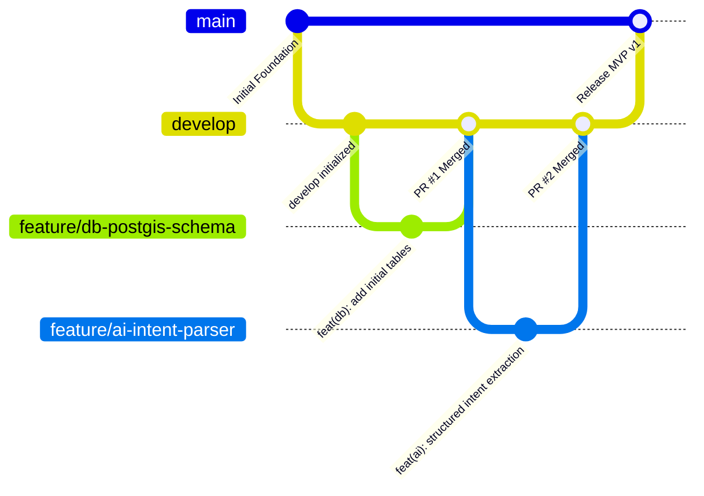

# Project Unknown - Development & Collaboration Guide

This guide establishes the engineering practices, Git workflow, and module ownership for our 6-member student team to build Project Unknown without blocking or breaking each other's code.

---

## 1. Module Ownership & Team Responsibilities

To ensure independent parallel development with clear accountability, every module has a designated owner:

```
project-unknown/
├── mobile/       --> Owned by Member 2 (UI/Client) & Member 6 (Maps/Worker Features)
├── backend/      --> Owned by Member 3 (FastAPI Monolith) & Member 1 (Integration)
├── ai/           --> Owned by Member 5 (AI Parser & Matching)
├── database/     --> Owned by Member 4 (PostgreSQL, PostGIS & Supabase)
└── docs/         --> Co-maintained by Member 1 (Lead) & Member 6
```

### Detailed Roles:

* **Member 1 (Integration & Architecture Lead)**:
  * Manages repository integrity, PR approvals, branch merges, and API contract alignment between frontend and backend.
  * Coordinates end-to-end integration across modules.
* **Member 2 (Flutter Mobile Lead)**:
  * Builds customer UI flows: problem input screen, results list, booking confirmation, and Supabase Auth screens.
  * Implements Dio network client using the specifications in [`docs/api-contract.md`](api-contract.md).
* **Member 3 (FastAPI Backend Lead)**:
  * Implements FastAPI routes (`/auth`, `/workers`, `/requests`, `/bookings`, `/skills`), Supabase JWT verification middleware, and database access logic.
  * Ensures all endpoint inputs and outputs strictly match the API contract.
* **Member 4 (Database & PostGIS Lead)**:
  * Writes SQL migrations in `database/migrations/` for tables and PostGIS spatial indexes (`GIST`).
  * Creates realistic seed datasets in `database/seeds/` with coordinate data.
  * Configures Supabase RLS (Row-Level Security) policies.
* **Member 5 (AI & Matching Lead)**:
  * Develops the decoupled intent/skill extraction parser in `ai/` using LLM structured outputs.
  * Defines category and skill taxonomies.
  * Implements the deterministic candidate ranking scoring algorithm in collaboration with Member 3.
* **Member 6 (Maps & Worker-Side Features Lead)**:
  * Implements mobile map integration (Google Maps / Mapbox markers, camera positioning, user location permissions).
  * Builds worker-facing mobile screens (profile setup, availability toggle).

---

## 2. Git & GitHub Branch Strategy

We follow a **Trunk-Based / Feature Branch** workflow centered on a protected `main` branch and an active `develop` branch:



### Branch Naming Standard
All feature branches must branch off `develop` and follow this naming format:
- `feature/<module>-<short-description>` (e.g., `feature/ai-intent-parser`, `feature/mobile-auth-screen`, `feature/db-postgis-schema`)
- `fix/<module>-<bug-description>` (e.g., `fix/backend-jwt-validation`, `fix/mobile-location-permission`)
- `docs/<doc-name>` (e.g., `docs/update-api-contract`)

---

## 3. Commit Message Conventions (Conventional Commits)

Format: `<type>(<scope>): <short description>`

* **Types**:
  * `feat`: A new feature
  * `fix`: A bug fix
  * `docs`: Documentation updates only
  * `refactor`: Code change that neither fixes a bug nor adds a feature
  * `test`: Adding or correcting tests
  * `chore`: Maintenance, dependencies, or configuration changes
* **Examples**:
  * `feat(db): create worker_profiles table with PostGIS location column`
  * `feat(backend): add Supabase JWT verification dependency`
  * `feat(ai): implement Gemini intent parser adapter`
  * `feat(mobile): add problem description text field and submit button`
  * `fix(backend): correct latitude longitude coordinate ordering in PostGIS query`
  * `docs(api): add /skills response sample to contract`

---

## 4. Pull Request (PR) & Review Protocol

To prevent merge conflicts and broken builds:
1. **Pull Latest `develop` First**:
   ```bash
   git checkout develop
   git pull origin develop
   git checkout feature/your-feature
   git merge develop
   ```
2. **Self-Review**:
   - Verify no secrets or real API keys are committed.
   - Ensure the code follows the API contract in [`docs/api-contract.md`](api-contract.md).
3. **Open Pull Request**:
   - Target branch: `develop` (NEVER open a PR directly into `main`).
   - Title: Follow conventional commit format.
   - Description: Explain what was added/changed and how to test it.
4. **Peer Approval**:
   - Every PR requires **at least 1 review approval** (Member 1 or designated module peer) before merging.
   - Use **Squash and Merge** to maintain a clean history.

---

## 5. Local Development Principles: How 6 Members Work Without Breaking Code

1. **Mocking & API Contracts as First-Class Citizens**:
   - Mobile developers (Member 2 & 6) do NOT need to wait for the backend to be completed. They build UI against the mock JSON defined in [`docs/api-contract.md`](api-contract.md).
   - Backend developers (Member 3) build endpoints to match the exact schema contract.
2. **Decoupled AI Development**:
   - The AI lead (Member 5) works inside `ai/` independently with unit tests and mock prompts. The backend simply imports the clean parser interface.
3. **Database Migrations Only (No Manual Supabase Dashboard Changes)**:
   - All schema changes must be recorded as reproducible `.sql` files in `database/migrations/`.
   - Never alter live Supabase tables manually without adding the corresponding migration script.
4. **Environment Isolation**:
   - Each developer maintains their own local `.env` copied from [`.env.example`](../.env.example).
   - Never edit or commit `.env`.
