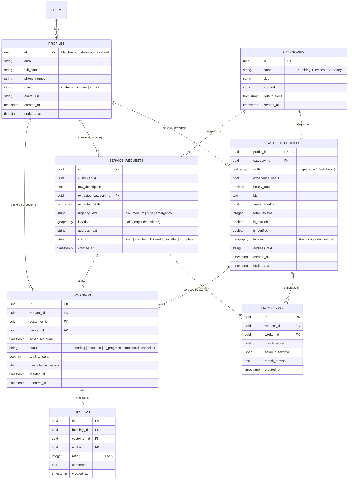
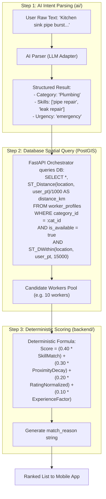
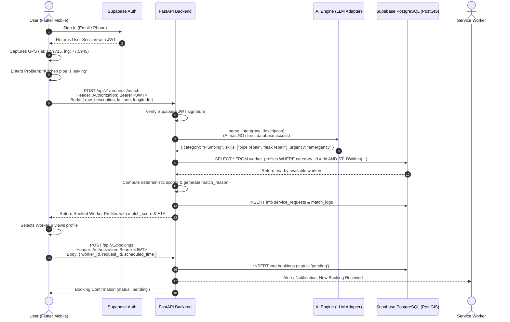

# Project Unknown - Technical Foundation Document (Approved Architecture)

## 1. System Architecture (Modular Monolith)

**Project Unknown** connects users with nearby skilled local service providers through an intelligent problem-understanding and spatial matching pipeline.

### Architectural Blueprint

```mermaid
graph TB
    subgraph "Client Layer (mobile/)"
        FlutterApp["Flutter Mobile App (iOS / Android)"]
    end

    subgraph "Authentication Provider (Supabase Auth)"
        SupaAuth["Supabase Auth (Issues & Manages JWTs)"]
    end

    subgraph "Backend Tier - Modular Monolith (backend/)"
        FastAPI["FastAPI Application"]
        AuthMiddleware["Supabase JWT Verification Middleware"]
        Routers["Domain Routers (/auth, /workers, /requests, /bookings)"]
        MatchOrchestrator["Matching Orchestration Service"]
        DeterministicRanker["Deterministic Ranking Engine"]
    end

    subgraph "AI Intelligence Layer (ai/)"
        AIModule["AI Intent & Skill Parser (Gemini / OpenAI Adapter)"]
    end

    subgraph "Data & Persistence Tier (database/)"
        PostgresDB[("PostgreSQL + PostGIS (Spatial & Relational Store)")]
        SupaStorage["Supabase Storage (Worker Avatars & Portfolio)"]
    end

    subgraph "External Client Services"
        MapsService["Google Maps / Mapbox (Client Map Rendering & Geocoding)"]
    end

    %% Client Auth Flow
    FlutterApp -->|"1. Auth Sign In / Up"| SupaAuth
    SupaAuth -->>|"Returns User Session & JWT"| FlutterApp

    %% Client to Backend Flow
    FlutterApp -->|"2. API Requests: Header 'Authorization: Bearer <JWT>' + JSON Body (lat, lng, problem)"| FastAPI
    FlutterApp -->|"3. Display Map Tiles & Address Autocomplete"| MapsService
    FlutterApp -->|"4. Upload Profile Photos"| SupaStorage

    %% Backend Verification & Routing
    FastAPI --> AuthMiddleware
    AuthMiddleware -->|"Validate JWT signature via SUPABASE_JWT_SECRET"| Routers
    Routers --> MatchOrchestrator

    %% Decoupled AI & Database Flow
    MatchOrchestrator -->|"A. Send Raw Problem Text"| AIModule
    AIModule -->>|"Return Structured Intent & Skills (No DB Access)"| MatchOrchestrator
    MatchOrchestrator -->|"B. Execute Spatial PostGIS Query (ST_DWithin & Category)"| PostgresDB
    PostgresDB -->>|"Return Nearby Available Workers"| MatchOrchestrator
    MatchOrchestrator -->|"C. Rank Candidates"| DeterministicRanker
    DeterministicRanker -->>|"Ranked Workers + Match Reason"| MatchOrchestrator
    MatchOrchestrator -->>|"Return Response Payload"| FlutterApp
```

### Core Architecture Principles

1. **Authentication vs. Location Separation**:
   - Authentication is transmitted strictly via the standard HTTP header: `Authorization: Bearer <supabase_jwt_token>`.
   - GPS coordinates (`latitude`, `longitude`, `address_text`) are normal request payload data in the JSON request body or query parameters.
2. **Supabase Auth as Identity Provider**:
   - Supabase Auth handles user registration, password/OTP verification, and session lifecycle on the client.
   - FastAPI sits behind an authentication dependency that decodes and cryptographically verifies the Supabase JWT using `SUPABASE_JWT_SECRET` (or Supabase public keys) to extract `user_id` and user role for every protected endpoint.
3. **Strict AI Decoupling (No Direct DB Access)**:
   - The `ai/` module is a pure analytical engine (stateless input $\rightarrow$ output). It receives raw text and outputs structured JSON (categories, skills, urgency).
   - The AI module **never** connects to PostgreSQL or queries worker records.
   - The **Matching Orchestrator** in `backend/` bridges the two: it calls the AI module first, takes the extracted category and skills, and executes the SQL/PostGIS query against the database separately.
4. **Deterministic Ranking for MVP v1**:
   - MVP v1 uses a robust, reproducible, and explainable **formula-based deterministic ranking algorithm** combining skill overlap, spatial proximity decay, rating, and experience.
   - Lightweight ML / Embedding rankers are isolated as Phase 2 extensions without requiring any frontend or database contract changes.
5. **PostGIS as Primary Spatial Engine**:
   - PostGIS handles all spatial filtering, geofencing, and distance calculations via `ST_DWithin` and `ST_Distance`.
   - Google Maps / Mapbox is used strictly on the client application for map display, pin markers, user reverse geocoding, and future live navigation/ETA.
6. **FastAPI as a Modular Monolith**:
   - A single FastAPI service organized into clear internal domains (`routers/`, `services/`, `models/`, `core/`), avoiding distributed microservices complexity for the student hackathon MVP.

---

## 2. Modules & Ownership

```
project-unknown/
├── mobile/       # Flutter Mobile Application
├── backend/      # FastAPI Modular Monolith Server
├── ai/           # AI Intent & Skill Parsing Engine
├── database/     # Supabase / PostGIS Schema & Migrations
├── docs/         # System Documentation & API Contracts
├── .env.example  # Centralized environment variable template
├── .gitignore    # Standard Git ignore rules
└── README.md     # Project overview and team guide
```

---

## 3. Database Entities & Schema (PostgreSQL + PostGIS)



---

## 4. API Endpoints Specification

### 4.1 Core Matching Endpoint

#### `POST /api/v1/requests/match`

* **Headers**:
  ```http
  Authorization: Bearer <supabase_jwt_token>
  Content-Type: application/json
  ```
* **Request Body**:
  ```json
  {
    "raw_description": "Water pipe under kitchen sink burst and leaking rapidly",
    "latitude": 12.971598,
    "longitude": 77.594562,
    "address_text": "MG Road, Bengaluru, Karnataka",
    "max_radius_km": 15.0,
    "limit": 10
  }
  ```
* **Response Body (200 OK)**:
  ```json
  {
    "request_id": "8fa1c4d2-3b2e-4b6e-a25e-5c4d2e8b1a9f",
    "ai_analysis": {
      "detected_category": "Plumbing",
      "category_id": "c1a2b3c4-d5e6-7f8a-9b0c-1d2e3f4a5b6c",
      "extracted_skills": ["pipe repair", "leak repair", "emergency plumbing"],
      "urgency": "emergency",
      "confidence_score": 0.95,
      "problem_summary": "Burst pipe causing active water leak in kitchen cabinet."
    },
    "total_candidates_found": 6,
    "ranked_workers": [
      {
        "worker_id": "7b8c9d0e-1f2a-3b4c-5d6e-7f8a9b0c1d2e",
        "full_name": "Ramesh Kumar",
        "avatar_url": "https://supabase-storage.url/avatars/ramesh.jpg",
        "phone_number": "+919876543210",
        "hourly_rate": 350.00,
        "average_rating": 4.8,
        "total_reviews": 42,
        "distance_km": 2.35,
        "match_score": 93.4,
        "match_reason": "Matches required pipe and leak repair skills; 2.4 km away with a 4.8-star rating.",
        "skills": ["pipe repair", "leak repair", "sanitary fittings"]
      }
    ]
  }
  ```

---

## 5. AI & Deterministic Matching Pipeline (MVP v1)



### Deterministic Scoring Formula
For candidate worker $i$:
$$\text{Score}_i = 100 \times \left( w_s \cdot S_i + w_d \cdot D_i + w_r \cdot R_i + w_e \cdot E_i \right)$$

1. **Skill Match Score ($S_i \in [0, 1]$)**:
   $$S_i = \frac{|\text{ExtractedSkills} \cap \text{WorkerSkills}_i|}{|\text{ExtractedSkills}|}$$
2. **Proximity Decay ($D_i \in [0, 1]$)**:
   $$D_i = \max\left(0, 1 - \frac{d_i}{d_{\max}}\right)$$
3. **Rating Score ($R_i \in [0, 1]$)**:
   $$R_i = \left(\frac{\text{average\_rating}_i}{5.0}\right) \times \min\left(1.0, \frac{\text{total\_reviews}_i}{10}\right)$$
4. **Experience Factor ($E_i \in [0, 1]$)**:
   $$E_i = \min\left(1.0, \frac{\text{experience\_years}_i}{10}\right)$$
5. **Default Weights**: $w_s = 0.40$, $w_d = 0.30$, $w_r = 0.20$, $w_e = 0.10$.

---

## 6. End-to-End Sequence Diagram



---

## 7. Recommended Development Roadmap (Incremental Phases)

1. **Phase 1: Foundation (Current)**:
   - Folder structure, documentation, environment template, and database schema migrations.
2. **Phase 2: Database & Backend Core**:
   - Supabase PostGIS tables & seed worker data.
   - FastAPI skeleton, Supabase JWT verification middleware, profiles & workers CRUD.
3. **Phase 3: AI Parser & Matching Engine**:
   - Intent extraction adapter (`ai/`), PostGIS spatial query integration, deterministic ranker.
4. **Phase 4: Flutter MVP Application**:
   - Supabase Auth integration, problem input & GPS capture, worker map/feed, booking flow.
5. **Phase 5: Integration & Demo Testing**:
   - Postman test collection, end-to-end flow validation, edge-case handling.
